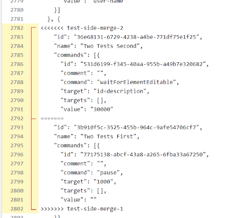
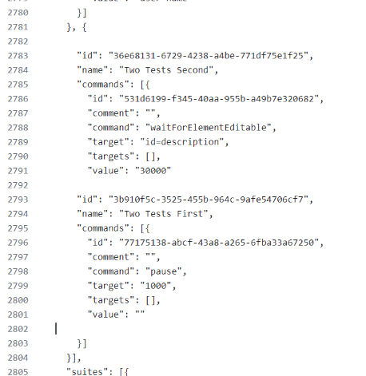
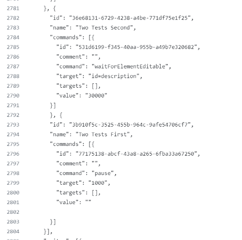

# Merging Side Files Cases

## Two Separate Commits Both Add New Tests |&cross;|

In the case that two separate commits both add unique tests the merge conflict will look something like the following:

Following the suggested merge:

Does not work...

It will only add the top test.

To actually get it to work requires adding proper brackets such as this:

